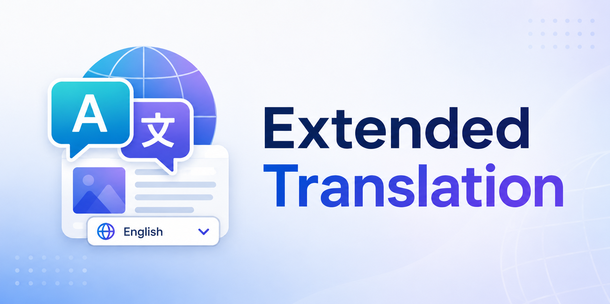

# Extended Translation

## English

Azuriom plugin to translate news posts, pages, navbar items, FAQ questions, wiki pages, vote reward names, changelog content, and shop catalog copy from the admin panel, without changing Azuriom core. It also provides a public language dropdown that themes can include.

FAQ, Wiki, Vote, Changelog, and Shop translation are optional: install and enable the [FAQ](https://market.azuriom.com/resources/4), [Wiki](https://market.azuriom.com/resources/28), [Vote](https://market.azuriom.com/resources/2), [Changelog](https://market.azuriom.com/resources/53), or [Shop](https://market.azuriom.com/resources/1) plugin to show those items in **Admin → Translations**. Wiki search still uses the original language; only displayed category names, page titles, and page content are translated. Vote translation covers reward names only. Changelog translation covers the page title, category names, and update names and content. Shop translation covers category names and descriptions, package names and descriptions, offer names, and variable labels (including dropdown option labels).

### Permissions

Grant these from **Admin → Roles**. Admin roles already have every permission. Other roles must have the matching box checked, or they cannot translate that content or open plugin settings.

`admin.access` is still required to enter the admin panel.

| Permission | Description |
|---|---|
| `extended-translation.posts` | Translate news articles. Also required to show the Translate button on Azuriom’s Posts admin pages. |
| `extended-translation.pages` | Translate pages. Also required to show the Translate button on Azuriom’s Pages admin pages. |
| `extended-translation.navbar` | Translate navbar items. Also required to show the Translate button on Azuriom’s Navbar admin pages. |
| `extended-translation.faq` | Translate FAQ questions. Only listed when the FAQ plugin is installed and enabled. Also required to show the Translate button on FAQ admin pages. |
| `extended-translation.wiki` | Translate wiki pages and categories. Only listed when the Wiki plugin is installed and enabled. Also required to show the Translate button on Wiki admin pages. |
| `extended-translation.vote` | Translate vote reward names. Only listed when the Vote plugin is installed and enabled. Also required to show the Translate button on Vote reward admin pages. |
| `extended-translation.changelog` | Translate changelog categories, updates, and page title. Only listed when the Changelog plugin is installed and enabled. Also required to show the Translate button on Changelog admin pages. |
| `extended-translation.shop` | Translate shop categories, packages, offers, and variables. Only listed when the Shop plugin is installed and enabled. Also required to show the Translate button on Shop admin pages. |
| `extended-translation.settings` | Open and save the plugin settings (enabled languages and inject buttons). |

### Theme language dropdown

- [Language dropdown for themes](docs/theme-language-selector.md)

## Français

Plugin Azuriom pour traduire les articles, les pages, les éléments de la barre de navigation, les questions de la FAQ, les pages du wiki, les noms des récompenses de vote, le contenu du changelog et les textes de la boutique depuis le panel administrateur, sans modifier le coeur d’Azuriom. Il fournit aussi un menu déroulant de langue que les thèmes peuvent inclure.

La traduction de la FAQ, du wiki, de Vote, du Changelog et de la Boutique est facultative : installez et activez le plugin [FAQ](https://market.azuriom.com/resources/4), [Wiki](https://market.azuriom.com/resources/28), [Vote](https://market.azuriom.com/resources/2), [Changelog](https://market.azuriom.com/resources/53) ou [Boutique](https://market.azuriom.com/resources/1) pour afficher ces entrées dans **Admin → Traductions**. La recherche du wiki utilise toujours la langue originale ; seuls les noms de catégories, les titres et le contenu des pages affichés sont traduits. La traduction de Vote concerne uniquement les noms des récompenses. La traduction du Changelog concerne le titre de la page, les noms de catégories et les noms et contenus des mises à jour. La traduction de la Boutique concerne les noms et descriptions des catégories, les noms et descriptions des produits, les noms des offres et les libellés des variables (y compris les options de liste).

### Permissions

Attribuez-les depuis **Admin → Rôles**. Les rôles administrateur ont déjà toutes les permissions. Les autres rôles doivent cocher la case correspondante, sinon ils ne peuvent pas traduire ce contenu ni ouvrir les paramètres du plugin.

`admin.access` reste nécessaire pour entrer dans le panel administrateur.

| Permission | Description |
|---|---|
| `extended-translation.posts` | Traduire les articles. Aussi requis pour afficher le bouton Traduire sur les pages d’administration Articles d’Azuriom. |
| `extended-translation.pages` | Traduire les pages. Aussi requis pour afficher le bouton Traduire sur les pages d’administration Pages d’Azuriom. |
| `extended-translation.navbar` | Traduire les éléments de la barre de navigation. Aussi requis pour afficher le bouton Traduire sur les pages d’administration Navbar d’Azuriom. |
| `extended-translation.faq` | Traduire les questions de la FAQ. Affiché seulement si le plugin FAQ est installé et activé. Aussi requis pour afficher le bouton Traduire sur les pages d’administration de la FAQ. |
| `extended-translation.wiki` | Traduire les pages et catégories du wiki. Affiché seulement si le plugin Wiki est installé et activé. Aussi requis pour afficher le bouton Traduire sur les pages d’administration du wiki. |
| `extended-translation.vote` | Traduire les noms des récompenses de vote. Affiché seulement si le plugin Vote est installé et activé. Aussi requis pour afficher le bouton Traduire sur les pages d’administration des récompenses de Vote. |
| `extended-translation.changelog` | Traduire les catégories, mises à jour et le titre de page du changelog. Affiché seulement si le plugin Changelog est installé et activé. Aussi requis pour afficher le bouton Traduire sur les pages d’administration du changelog. |
| `extended-translation.shop` | Traduire les catégories, produits, offres et variables de la boutique. Affiché seulement si le plugin Boutique est installé et activé. Aussi requis pour afficher le bouton Traduire sur les pages d’administration de la boutique. |
| `extended-translation.settings` | Ouvrir et enregistrer les paramètres du plugin (langues activées et boutons d’injection). |

### Menu déroulant de langue

- [Menu déroulant de langue pour les thèmes](docs/theme-language-selector.fr.md)
